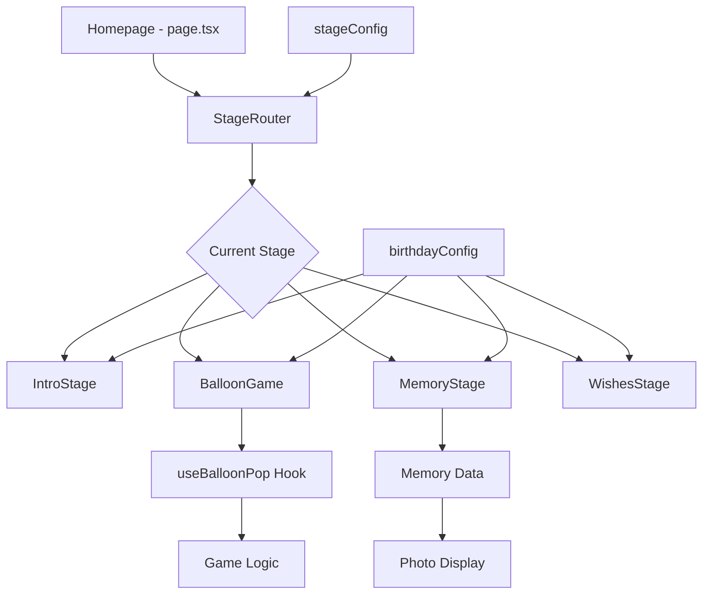

# 📁 Project Structure Guide

This document explains what each file and directory does in the Birthday Experience project.

## 📋 Table of Contents
1. [Root Directory](#root-directory)
2. [Source Code (`src/`)](#source-code-src)
3. [Configuration Files](#configuration-files)
4. [Public Assets](#public-assets)
5. [Component Breakdown](#component-breakdown)
6. [Utility Functions](#utility-functions)

## Root Directory

```
aisha-birthday/
├── 📁 public/              # Static assets (images, icons)
├── 📁 src/                 # Main source code
├── 📄 .eslintrc.json       # Code linting rules
├── 📄 .gitignore          # Git ignore patterns
├── 📄 next.config.js      # Next.js configuration
├── 📄 package.json        # Dependencies and scripts
├── 📄 tailwind.config.ts  # Tailwind CSS configuration  
├── 📄 tsconfig.json       # TypeScript configuration
├── 📄 README.md           # Basic project info
├── 📄 CUSTOMIZATION_GUIDE.md  # How to customize (you are here!)
└── 📄 PROJECT_STRUCTURE.md    # This file
```

### Key Root Files

**`package.json`**
- Lists all dependencies (React, Next.js, Framer Motion, etc.)
- Defines scripts: `npm run dev`, `npm run build`, `npm start`
- Project metadata and version info

**`next.config.js`**
- Next.js framework configuration
- Image optimization settings
- Build and deployment options

**`tailwind.config.ts`**
- Tailwind CSS styling framework setup
- Custom colors, fonts, and utility classes
- Responsive breakpoints

**`tsconfig.json`**
- TypeScript compiler configuration
- Path aliases (like `@/` for `src/`)
- Type checking rules

## Source Code (`src/`)

```
src/
├── 📁 app/                 # Next.js 14 App Router
├── 📁 components/          # React components
├── 📁 config/             # Configuration files
├── 📁 lib/                # Utility libraries
└── 📁 styles/             # CSS styling
```

### App Directory (`src/app/`)

```
src/app/
├── 📄 globals.css         # Global CSS imports
├── 📄 layout.tsx          # Root layout component
├── 📄 page.tsx            # Homepage component
└── 📄 favicon.ico         # Website icon
```

**`layout.tsx`** - Root Layout
- Wraps entire application
- Sets up HTML structure, fonts, metadata
- Provides consistent layout across all pages

**`page.tsx`** - Homepage
- Main landing page
- Contains the birthday experience flow
- Manages stage navigation and progress

### Components (`src/components/`)

```
src/components/
├── 📁 stages/             # Individual stage components
├── 📁 ui/                 # Reusable UI components  
└── 📁 animations/         # Animation definitions
```

#### Stage Components (`src/components/stages/`)

```
src/components/stages/
├── 📄 StageRouter.tsx     # Routes between different stages
├── 📄 IntroStage.tsx      # Welcome/introduction stage
├── 📄 BalloonGame.tsx     # Balloon popping game
├── 📄 MemoryStage.tsx     # Photo memories display
├── 📄 MemoryGame.tsx      # Memory matching game
├── 📄 TraitsStage.tsx     # Personality traits showcase
├── 📄 TriviaGame.tsx      # Birthday trivia game
├── 📄 CakeStage.tsx       # Interactive birthday cake
└── 📄 WishesStage.tsx     # Final birthday wishes
```

**Purpose of Each Stage:**

1. **`StageRouter.tsx`** - Central Navigation Hub
   - Manages which stage component to display
   - Handles transitions between stages
   - Provides consistent navigation controls

2. **`IntroStage.tsx`** - Welcome Screen
   - First stage users see
   - Introduces the birthday person
   - Sets the mood for the experience

3. **`BalloonGame.tsx`** - Interactive Game
   - Balloon popping mini-game
   - Score tracking and timer
   - Uses game engine for logic

4. **`MemoryStage.tsx`** - Photo Gallery
   - Displays cherished memories
   - Photo carousel with descriptions
   - Emotional connection building

5. **`MemoryGame.tsx`** - Memory Matching
   - Card matching puzzle game
   - Tests memory skills
   - Customizable difficulty

6. **`TraitsStage.tsx`** - Personality Showcase
   - Highlights personal qualities
   - Animated trait displays
   - Positive affirmations

7. **`TriviaGame.tsx`** - Knowledge Quiz
   - Birthday-themed questions
   - Multiple choice format
   - Personal facts and fun trivia

8. **`CakeStage.tsx`** - Cake Celebration
   - Interactive birthday cake
   - Candle blowing animation
   - Celebration effects

9. **`WishesStage.tsx`** - Final Wishes
   - Heartfelt birthday messages
   - Concluding the experience
   - Thank you and celebration

#### UI Components (`src/components/ui/`)

```
src/components/ui/
├── 📄 Button.tsx          # Reusable button component
├── 📄 ProgressBar.tsx     # Stage progress indicator
├── 📄 ConfettiEffect.tsx  # Celebration animations
└── 📄 LoadingSpinner.tsx  # Loading state component
```

**Reusable Components:**
- **Button**: Consistent styling for all buttons
- **ProgressBar**: Shows progress through stages
- **ConfettiEffect**: Celebration particle effects
- **LoadingSpinner**: Loading states during transitions

### Configuration (`src/config/`)

```
src/config/
├── 📄 birthdayConfig.ts   # Personal information & content
├── 📄 stageConfig.ts      # Stage flow & settings
└── 📄 animationConfig.ts  # Animation presets
```

**`birthdayConfig.ts`** - Main Configuration
- **Personal Info**: Name, age, birthday
- **Theme Colors**: Primary, secondary, accent colors
- **Content**: Personality traits, hobbies, memories
- **Photos**: Memory images and descriptions
- **Text Placeholders**: {{name}}, {{hobby}}, {{trait}}

**`stageConfig.ts`** - Stage Management
- **Stage Order**: Which stages appear and when
- **Stage Settings**: Auto-advance, timing, difficulty
- **Game Configuration**: Balloon count, time limits
- **Navigation Rules**: Skip conditions, requirements

**`animationConfig.ts`** - Animation Library
- **Transition Effects**: Stage entry/exit animations
- **Game Animations**: Balloon pops, card flips
- **Special Effects**: Confetti, sparkles, celebrations
- **Timing**: Duration, delays, easing functions

### Library (`src/lib/`)

```
src/lib/
├── 📁 gameEngine/         # Game logic systems
├── 📁 animations/         # Animation utilities
└── 📁 utils/             # Helper functions
```

#### Game Engine (`src/lib/gameEngine/`)

```
src/lib/gameEngine/
├── 📄 useBalloonPop.ts    # Balloon game logic
├── 📄 useMemoryMatch.ts   # Memory game logic
├── 📄 useTrivia.ts        # Trivia game logic
└── 📄 gameTypes.ts        # Type definitions
```

**Game Hooks - What They Do:**

1. **`useBalloonPop.ts`** - Balloon Game Engine
   - **Balloon Generation**: Creates balloons at random positions
   - **Pop Detection**: Handles click/touch events
   - **Scoring System**: Tracks score and progress
   - **Timer Management**: Countdown and game completion
   - **Difficulty Scaling**: Adjusts balloon spawn rate

2. **`useMemoryMatch.ts`** - Memory Game Engine  
   - **Card Grid**: Generates card pairs
   - **Flip Logic**: Manages card reveal/hide
   - **Match Detection**: Checks for pair matches
   - **Game State**: Tracks moves and completion
   - **Shuffle Algorithm**: Randomizes card positions

3. **`useTrivia.ts`** - Trivia Game Engine
   - **Question Management**: Loads and displays questions
   - **Answer Validation**: Checks correct answers
   - **Score Tracking**: Points and progress
   - **Hint System**: Provides helpful clues
   - **Question Shuffle**: Random question order

4. **`gameTypes.ts`** - Type Definitions
   - **Game State Types**: Defines game status structures
   - **Player Data**: Score, progress, achievements
   - **Configuration Types**: Game settings and options
   - **Event Types**: User interactions and callbacks

### Styles (`src/styles/`)

```
src/styles/
└── 📄 globals.css         # Global styling and themes
```

**`globals.css`** - Master Stylesheet
- **CSS Variables**: Theme colors, fonts, spacing
- **Component Styles**: Button, card, animation classes
- **Responsive Design**: Mobile, tablet, desktop layouts
- **Theme System**: Light/dark mode support
- **Custom Animations**: Keyframes and transitions

## Public Assets (`public/`)

```
public/
├── 📁 photos/             # User-uploaded images
├── 📄 favicon.ico         # Website icon
└── 📄 manifest.json       # PWA configuration
```

### Photos Directory (`public/photos/`)

```
public/photos/
├── 📸 memory1.jpg         # Memory photos for gallery
├── 📸 memory2.jpg         # Add your own photos here
├── 📸 memory3.jpg         # Supported: .jpg, .png, .webp
├── 📸 profile.jpg         # Main profile photo
├── 📸 cake.jpg           # Birthday cake image
└── 📸 celebration.jpg     # Final celebration photo
```

**Image Requirements:**
- **Format**: JPG, PNG, or WebP
- **Size**: Recommended 1920x1080 or smaller
- **Naming**: Use descriptive names for easy management
- **Optimization**: Images auto-optimized by Next.js

## Component Breakdown

### How Components Work Together



### Data Flow

1. **Configuration Loading**
   - `birthdayConfig.ts` loads personal data
   - `stageConfig.ts` defines stage order
   - CSS variables set theme colors

2. **Stage Navigation**
   - `StageRouter` manages current stage
   - Progress tracking across stages
   - Navigation controls (next/previous)

3. **Game Integration**
   - Game hooks manage complex logic
   - State management for scores/progress
   - Integration with stage system

4. **Animation System**
   - Framer Motion for smooth transitions
   - CSS animations for special effects
   - Coordinated timing across components

## Utility Functions

### Common Patterns

**Text Processing:**
```typescript
// In most stage components
const processText = (text: string) => {
  return text
    .replace(/\{\{name\}\}/g, birthdayConfig.name)
    .replace(/\{\{hobby\}\}/g, birthdayConfig.hobbies[0])
    .replace(/\{\{trait\}\}/g, birthdayConfig.personalTraits[0])
}
```

**Stage Management:**
```typescript
// Navigation between stages
const handleNext = () => {
  onComplete()  // Mark current stage complete
  onNext()      // Move to next stage
}
```

**Game State:**
```typescript
// Typical game hook usage
const {
  gameState,
  startGame,
  endGame,
  updateScore
} = useGameHook(config)
```

## File Naming Conventions

- **Components**: PascalCase (`BalloonGame.tsx`)
- **Hooks**: camelCase with 'use' prefix (`useBalloonPop.ts`)
- **Config**: camelCase (`birthdayConfig.ts`)
- **Types**: PascalCase (`GameTypes.ts`)
- **Styles**: kebab-case (`globals.css`)

## Key Dependencies

**Framework & Core:**
- `next`: React framework with App Router
- `react`: UI library
- `typescript`: Type safety

**Styling & Animation:**
- `tailwindcss`: Utility-first CSS
- `framer-motion`: Animation library
- `@tailwindcss/typography`: Text styling

**Development:**
- `eslint`: Code linting
- `@types/*`: TypeScript definitions

## Quick Reference

**To Add a New Stage:**
1. Create component in `src/components/stages/`
2. Add to `StageRouter.tsx` imports
3. Add to `stageConfig.ts` stages array

**To Modify Game:**
1. Edit game hook in `src/lib/gameEngine/`
2. Update stage config in `stageConfig.ts`
3. Modify game component if needed

**To Change Styling:**
1. Update CSS variables in `globals.css`
2. Modify theme in `birthdayConfig.ts`
3. Adjust component classes as needed

**To Add Content:**
1. Update `birthdayConfig.ts` for personal info
2. Add photos to `public/photos/`
3. Modify stage text blocks in config

This structure makes the birthday experience highly modular and customizable while maintaining clean separation of concerns! 🎉 